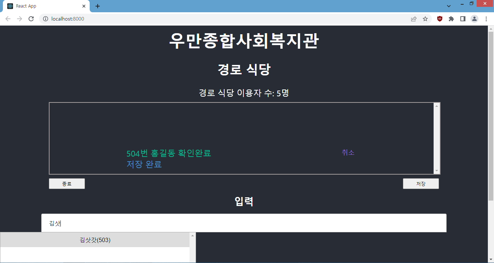

# 복지관 경로식당 이용자 관리 프로그램

---
## 개발 가이드

각 프로제트 별 README.md 참조
- [Backend](./backend/README.md)
- [Frontend](./frontend/README.md)
- [바로가기 만들기](./docs/1.md)

### 개발 언어 및 환경
- OS: Windows 8.1 K
- Python 3.8.10
- Node.js 16.15.1

---
